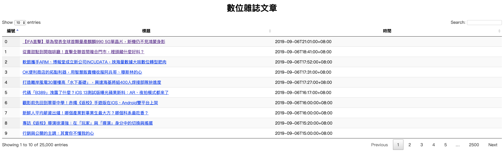

# BNEXT_NEWS_AGG

### A practice of concurrency:
- Collect bunch of sitemaps' news simultaneously.
- Handle http code status: 429 Too Many Request.
- Dispaly on my Web News Aggregation Page.
- Sitemap source: https://www.bnext.com.tw/sitemap/google


### Usage

Run up my Web News Aggregation Page.
```sh
  $ go run *.go 
```

### Result
Compare Concurrency with Sequiential Process of collecting 25000 News. ( log folder shows details )
```sh
  Sequiential: 2019/09/08 03:36:55 Collecting 25000 data took 19.418197275s
  Concurrency: 2019/09/08 03:38:27 Collecting 25000 data took 6.282016672s
```